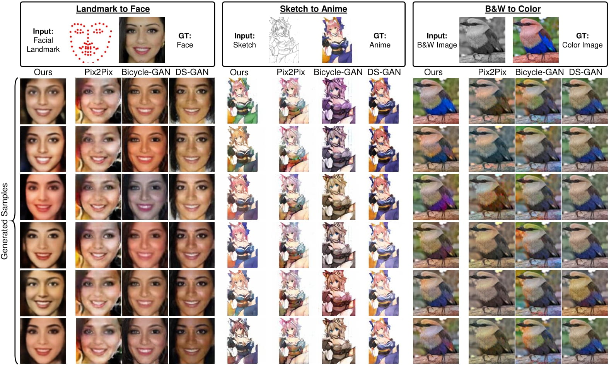

## Implementation of "Rethinking Conditional GAN training: an approach using geometrically structured latent manifolds." [[PDF](https://arxiv.org/abs/2011.13055)]

# Requirements
Tensorflow = 1.9
Python = 3.x
Scipy = 1.4

# Important
In the current version, the data directories and other paths should be directly edited in the code. We will update the repo with a more cleaned-up and a refactored version soon. 

# Train
python p2pGeo.py --mode=train

# Visualize
python p2pGeo.py --mode=visualize

